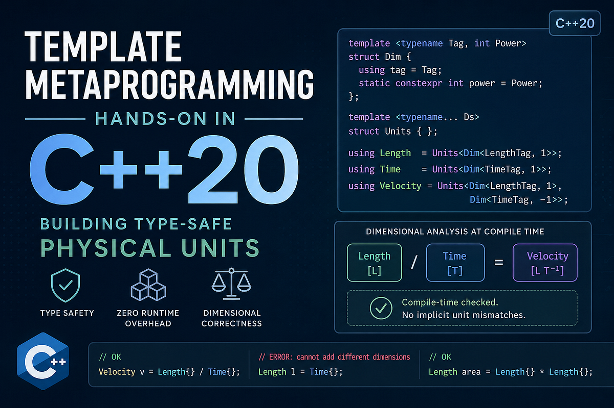

Originally posted on [Medium](https://medium.com/@gaurav.gokhale44/type-safe-physical-quantities-in-c-20-a3089264bede).



_This image is AI generated._

Recently, I've been exploring template metaprogramming and wanted to learn it through something more concrete than abstract examples. Physical quantities felt like a natural choice - they're easy to reason about and highlight how the type system can prevent real mistakes.

The idea is straightforward: the C++ type system already knows the difference between an int and a float - so why shouldn't it know the difference between momentum and energy. If we encode these quantities into types, the compiler can reject nonsensical expressions like adding a velocity to a mass, or catch the kind of dimensional mistake that famously caused NASA to lose the Mars Climate Orbiter in 1999 - a $327 million mistake that came down to one team using metric units and another using imperial. Strictly speaking, the system shown in here models dimensions, not units, since units also include scale (meters vs kilometers). For simplicity, I've used units to represent the collection of dimensions.

Let's try to understand the purpose of doing this. Suppose we represent physical quantities like mass, velocity, and momentum using plain numeric types:

```cpp
double vel = 2.0;
double mass = 2.0;
double mom = mass * vel;
```

The compiler has no objection to any of this. The variables are just numbers, and the mistake lives entirely in the programmer's head. This works, but it also means the compiler has no understanding of the units involved. So a physically incorrect assignment like this also compiles without complaint.

```cpp
double energy = mass * vel;
```

With a unit-aware type system, the same logic becomes a compile-time error the moment the dimensions don't work out - no runtime cost, no tests needed to catch it, just the compiler doing its job.

Building this turns out to be a surprisingly rich exercise in C++20 template metaprogramming: we need types that represent dimensions, arithmetic that operates on those types at compile time, and concepts that constrain the interface cleanly.

The goal is to encode units into the type system so that valid expressions work naturally, while invalid ones fail at compile time. In other words, we want to be able to write code like this:

```cpp
Velocity vel= 2.0;
Mass m = 2.0;
Momentum mom = m * vel;
```

## Units as types

Before writing any templates, it helps to think about what a physical unit really is.

Many derived physical quantities can be expressed in terms of a small set of fundamental dimensions. For example:

- length is L
- mass is M
- time is T
- velocity is LT^-1
- acceleration is LT^-2
- force is MLT^-2

So a unit can be thought of as a collection of dimensions, where each dimension carries two pieces of information:

- which fundamental quantity it refers to
- which exponent that quantity has in the final unit

That observation gives us a natural representation for units at the type level. Instead of treating Velocity or Force as isolated units, we can build them from smaller pieces.

## Representing dimensions in the type system

The smallest building block in this system is a single dimension together with its exponent. We'll represent that using a type called Dim:

```cpp
template<typename Tag, int Power>
struct Dim {
    using tag = Tag;
    static constexpr int power = Power;
};
```

Here, tag identifies the underlying physical dimension, while power stores its exponent. For example, we can define a few base tags like this:

```cpp
struct LengthTag {};
struct MassTag {};
struct TimeTag {};
```

Then a type like Dim<LengthTag, 1> represents length, while Dim<TimeTag, -1> represents an inverse power of time.

Of course, most useful physical quantities are not made up of just one dimension. Velocity, for instance, depends on both length and time. So we also need a way to represent a collection of dimensions. For that, we'll define a simple variadic type:

```cpp
template<typename... Ds>
struct Units {};
```

This lets us write types such as:

```cpp
using LengthUnit = Units<Dim<LengthTag, 1>>;
using VelocityUnit = Units<Dim<LengthTag, 1>, Dim<TimeTag, -1>>;
```

At this point, though, Units is too permissive. It can hold any types at all, not just dimensions. What we really want is to enforce that every element inside Units is a valid Dim type.

## Enforcing valid dimensions with concepts

The Units shown before has the right shape, but since it is defined as a variadic template over arbitrary types, nothing stops us from writing something nonsensical like a Units containing unrelated types.

What we really want is to express the following rule: every element inside Units must represent a valid dimension.

In C++20, concepts give us a clean way to express that constraint.

The first step is to define a trait that recognizes whether a type is an instance of Dim:

```cpp
template<typename T>
struct is_dim : std::false_type {};

template<typename Tag, int Power>
struct is_dim<Dim<Tag, Power>> : std::true_type {};
```

This gives us a compile-time predicate that is true only for types of the form Dim<Tag, Power>

```cpp
template<typename T>
concept DimType = is_dim<T>::value;
```

Now we can use that concept to constrain Units directly:

```cpp
template<DimType... Ds>
struct Units {};
```

With this change, Units is no longer just a container for arbitrary types. It now enforces one of the core invariants of the system: every element in a unit must itself be a dimension.

## Metafunctions

So far, we have a way to represent units as types. But representing them is only half the story. We also want to compute with them. For example, if momentum is mass times velocity, then we want the type system to be able to combine the corresponding unit types and produce the result at compile time.

In other words, we want something conceptually like this:

```cpp
using MassUnit = Units<Dim<MassTag, 1>>;
using VelocityUnit = Units<Dim<LengthTag, 1>, Dim<TimeTag, -1>>;
using MomentumUnit = /* combine MassUnit and VelocityUnit */;
```

This is where template metaprogramming becomes useful. Ordinary functions operate on values at runtime, but metafunctions operate on types at compile time.

As outlined in our goal, we want to do operations on Units as types and make new Units from those. One of the operations that we require is the multiplication operation. For that purpose, we'll implement a multiply_units metafunction. Before implementing multiply_units it helps to be precise about what multiplying two units should actually mean.

If we multiply two units, the following things need to happen:

- if the same base dimension appears in both units, their powers should be added
- if a dimension appears in only one unit, it should be preserved
- the final representation should be normalized, so equivalent units always map to the same type

That last point is especially important. If the representation is not normalized, then two physically equivalent units may still appear as different types to the compiler.

For example, multiplying LT by LT^-1 should conceptually give L^2 not L^2 T⁰. With those requirements in place, we can now think about how to combine two Units types at compile time.

## Commutative property of multiply

At first glance, multiplying two Units types may seem straightforward. We could just combine their dimensions and add powers where the tags match.

However, there is an important subtlety: the result must be canonical.

If two unit expressions are physically equivalent, they should produce exactly the same C++ type. Otherwise, the compiler would treat equivalent units as different, even though they mean the same thing.

For example, Mass * Velocity and Velocity * Massshould produce the same unit type. That means unit multiplication must be commutative not only in the physical sense, but also in the way the resulting type is represented.

To make that work, the dimensions inside Units need to appear in a consistent order. One simple way to achieve that is to give each base tag an ordering key or tag_index :

```cpp
struct LengthTag { static constexpr uint8_t tag_index = 0; };
struct MassTag   { static constexpr uint8_t tag_index = 1; };
struct TimeTag   { static constexpr uint8_t tag_index = 2; };
```

With this in place, we can insert dimensions into a Units list while keeping the list sorted by tag_index That gives us a stable representation for equivalent units, regardless of the order in which they are multiplied.

The core helper we need is a metafunction that inserts one dimension into an already sorted Units type. Conceptually, it has to handle three cases:

- the dimension already exists so the powers should be added
- the dimension does not match the tag of first element in Units, and it belongs before the first element
- the dimension does not match the tag of first element and it has tag_index greater than first element, then we need to keep searching recursively

## Insert_Dim metafunction

The helper that does most of the work is insert_dim Its job is to take a single dimension D and insert it into an already sorted Units list. At the type level, the general shape looks like this:

```cpp
template<DimType D, UnitType U>
struct insert_dim {};
```

### Case 1: the dimension already exists

If the first dimension in the list has the same tag as D, then we do not need to insert a new entry. Instead, we combine the two by adding their powers.

```cpp
// The first peeled off Dim(FirstDim) has same Tag as D, add their powers
template <DimType D, DimType FirstDim, DimType... Rest>
  requires(std::is_same_v<typename D::tag, typename FirstDim::tag>)
struct insert_dim<D, Units<FirstDim, Rest...>> {
  using type = Units<Dim<typename D::tag, D::power + FirstDim::power>, Rest...>;
};
```

### Case 2: the new dimension belongs before the current one

If the tags do not match, and D has a smaller tag_index then D must appear before the current element in the sorted order.

In that case, we can stop immediately and place D at the front.

```cpp
// The first peeled off Dim(FirstDim) doesn't match tag of D, and
// tag_index D < tag_index FirstDim
template<DimType D, DimType FirstDim, DimType...Rest>
requires(!std::is_same_v<typename D::tag, typename FirstDim::tag> &&
         D::tag::tag_index < FirstDim::tag::tag_index )
struct insert_dim<D, Units<FirstDim, Rest...>> {
    using type = Units<D, FirstDim, Rest...>;
};
```

### Case 3: keep searching recursively

The last case is when the tags do not match and D belongs later in the sorted order. In that case, we keep the current dimension, recurse into the rest of the list, and insert D there. Since the recursive call returns a new Units type, we can use a small helper prepend to rebuild the list as the recursion unwinds.

```cpp
// Prepend helper, puts D in front of list Ds
template<DimType D, DimType...Ds>
struct prepend<D, Units<Ds...>> {
    using type = Units<D, Ds...>;
};
```

We can then use this helper to recursively insert the D into the rest of the dims list

```cpp
template <DimType D, DimType FirstDim, DimType... Rest>
requires(!std::is_same_v<typename D::tag, typename FirstDim::tag> &&
         D::tag::tag_index >= FirstDim::tag::tag_index)
struct insert_dim<D, Units<FirstDim, Rest...>> {
    using type = prepend<FirstDim,
                         typename insert_dim<D, Units<Rest...>>::type>::type;
};
```

### Base case

If during recursion we reach an empty Units<> then D was not present anywhere in the list, so the result is simply a unit containing that single dimension.

```cpp
template<DimType D>
struct insert_dim<D, Units<>> {
    using type = Units<D>;
};
```

At this point, we can insert dimensions into a sorted unit and combine powers when tags match. However, there is still normalization problem left.

Suppose we multiply LT by LT^-1 After combining dimensions, we would get something equivalent to L^2T⁰

Physically, though, T^0 contributes nothing. If we leave it in the type, then physically equivalent units may still end up with different C++ representations. To fix that, we define one more helper: filter_zeros Its job is to remove any dimensions whose exponent becomes zero.

```cpp
template <DimType First, DimType... Rest>
struct filter_zeros<Units<First, Rest...>> {
    using type = std::conditional_t<
        First::power == 0,
        typename filter_zeros<Units<Rest...>>::type,
        typename prepend<First, typename filter_zeros<Units<Rest...>>::type>::type>;
};
```

We simply filter out the Dims with zero powers from the final output obtained after insert_dims. The std::conditional_t here is like a compile-time if-else statement. With insert_dim and filter_zeros in place, we now have the pieces needed to define multiply_units The idea is simple: take the dimensions from the second unit one by one, insert them into the first unit, and normalize the result as we go. With that in place, we can finally define multiply_units

The general form for this is simple, we want a function which multiplies two UnitType :

```cpp
template<UnitType U1, UnitType U2>
struct multiply_units {};
```

We need to peel off one Dim at a time from one of the lists and recursively insert it into the other. The specialized version of multiply_units hence looks something like this:

```cpp
template<typename... Ds1, typename First, typename... Rest>
struct multiply_units<Units<Ds1...>, Units<First, Rest...>> {
    using type = typename filter_zeros<
                    typename multiply_units<
                        typename insert_dim<First, Units<Ds1...>>::type,
                        Units<Rest...>
                    >::type
                 >::type;
};
```

To conveniently use the multiply_units we can define operator* which uses the multiply_units

```cpp
template<UnitType U1, UnitType U2>
auto operator*(U1, U2) -> typename multiply_units<U1, U2>::type;
```

This enables us to combine units with operator*

```cpp
using LengthUnit = Units<Dim<LengthTag, 1>>;
using AreaUnit = decltype(LengthUnit{} * LengthUnit{});
```

## Defining derived units more naturally

The division operation is just as important for us to conveniently compose units further. Fortunately, once multiply_units is available, division can be expressed in terms of multiplication by the inverse unit.

At the type level, taking the inverse of a unit just means negating the exponent of each of its dimensions. That is the role of a helper like negate_units

```cpp
template <DimType First, DimType... Rest>
struct negate_units<Units<First, Rest...>> {
    using type = typename prepend<Dim<typename First::tag, -First::power>,
                                  typename negate_units<Units<Rest...>>::type>::type;
};
```

With that helper, division becomes just another type-level operation built on top of multiplication:

```cpp
template<UnitType U1, UnitType U2>
auto operator/(U1, U2)
    -> typename multiply_units<U1, typename negate_units<U2>::type>::type;
```

This makes it possible to define derived units in a much more natural way:

```cpp
using LengthUnit = Units<Dim<LengthTag, 1>>;
using TimeUnit = Units<Dim<TimeTag, 1>>;
using MassUnit = Units<Dim<MassTag, 1>>;

using VelocityUnit = decltype(LengthUnit{} / TimeUnit{});
using AccelerationUnit = decltype(LengthUnit{} / (TimeUnit{} * TimeUnit{}));
using MomentumUnit = decltype(MassUnit{} * VelocityUnit{});
using ForceUnit = decltype(MassUnit{} * AccelerationUnit{});
using EnergyUnit = decltype(ForceUnit{} * LengthUnit{});
...
```

## From unit types to physical quantities

So far, we have built a type-level representation of units and a way to combine them at compile time. But units alone are not enough to model physical quantities in actual programs. A physical quantity needs two things:

- a numerical value
- a unit attached to that value

That is the role of Quantity For simplicity, we'll restrict the numerical type to int or double

```cpp
template<typename T>
concept QuantityValue = std::same_as<T, int> || std::same_as<T, double>;
```

With that in place, the Quantity class can carry both a runtime value and a compile-time unit:

```cpp
template<QuantityValue T, UnitType U>
class Quantity {
public:
    explicit Quantity(T val) : value_(val) {}

    T value_;
};
```

Here, T is the underlying numeric type, while U is the unit type. So a type like Quantity<double, VelocityUnit> represents a velocity. Since we already know how to multiply unit types, multiplying two quantities becomes straightforward. We multiply their values at runtime and combine their units at compile time:

```cpp
template <QuantityValue T, UnitType U1, UnitType U2>
auto operator*(const Quantity<T, U1>& lhs, const Quantity<T, U2>& rhs) {
    return Quantity<T, typename multiply_units<U1, U2>::type>(lhs.value_ * rhs.value_);
}
```

Similarly, other arithmetic operators can be defined and can be found in the final code attached in the compiler explorer link at the end of the blog.

At this point, we can finally write the kind of code we wanted from the beginning:

```cpp
Velocity vel(2.0);
Mass m(2.0);
Acceleration acc(4.0);

Momentum mom = m * vel;
Force f = m * acc;
// Force bad = m * vel;  // fails to compile
```

This is where the whole exercise pays off. The code still feels natural to write, but the compiler now understands enough about the units involved to reject invalid combinations.

## Where to go from here

This post builds a small units system from scratch as a way to understand the underlying template metaprogramming ideas. For real-world use, though, it is worth looking at established libraries that solve this problem much more completely.

Two especially relevant ones are [Boost.Units](https://www.boost.org/library/latest/units/) and [mp-units](https://mpusz.github.io/mp-units/HEAD/). If you want to see the full code behind this experiment, I've also put it in [Compiler Explorer](https://godbolt.org/z/bdde6deT3).
